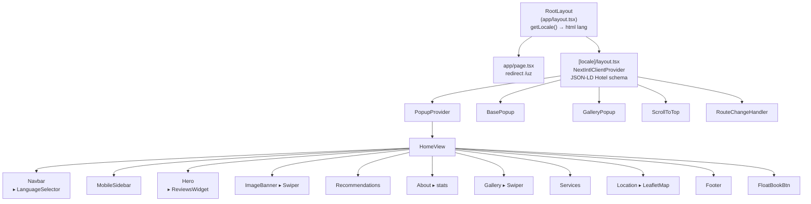
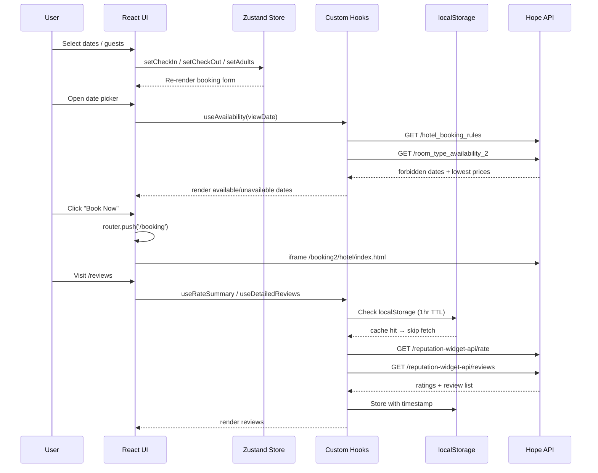
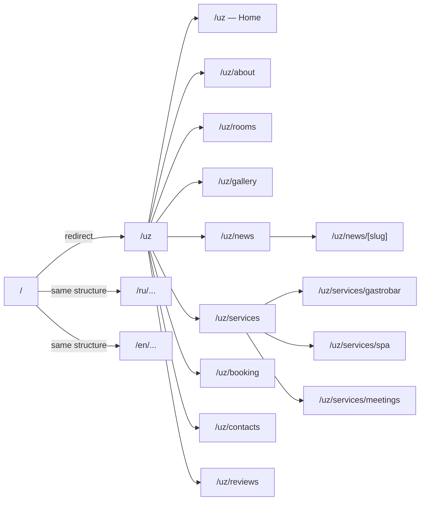
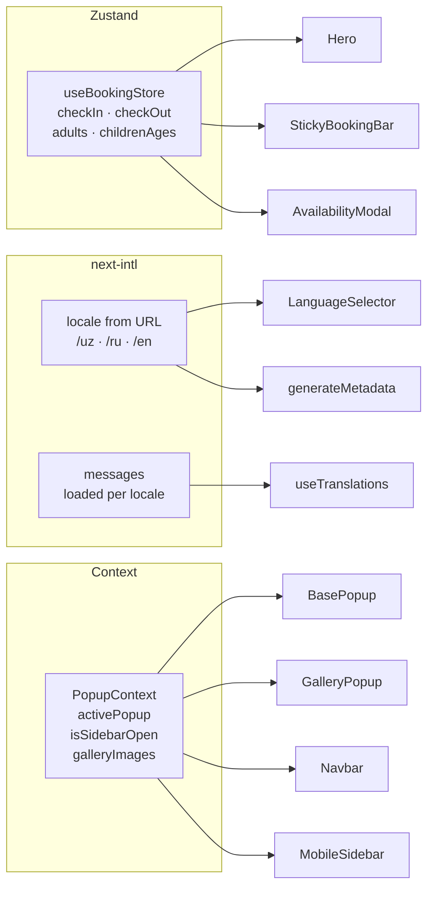

# Merhaba Hotel — Official Website

> **Above the Ordinary** — Official website for Merhaba Hotel. Built with Next.js 16 (App Router), TypeScript, Tailwind CSS v4, and URL-based multi-language routing.

**Live:** [merhabahotel.uz](https://merhabahotel.uz)

---

## Table of Contents

- [Tech Stack](#tech-stack)
- [Project Structure](#project-structure)
- [Architecture](#architecture)
- [Component Hierarchy](#component-hierarchy)
- [Data Flow](#data-flow)
- [Page Routing](#page-routing)
- [State Management](#state-management)
- [Getting Started](#getting-started)
- [Environment & Configuration](#environment--configuration)
- [Available Scripts](#available-scripts)
- [API Integrations](#api-integrations)
- [Internationalization](#internationalization)
- [SEO](#seo)
- [Color Palette](#color-palette)
- [Features](#features)

---

## Tech Stack

| Tool | Version | Purpose |
|------|---------|---------|
| [Next.js](https://nextjs.org) | 16.2.4 | Framework (App Router, SSG, image optimization) |
| [React](https://react.dev) | 19.2 | UI library |
| [TypeScript](https://www.typescriptlang.org) | 5.x | Type safety |
| [Tailwind CSS](https://tailwindcss.com) | v4 | Utility-first styling |
| [next-intl](https://next-intl-docs.vercel.app) | 4.x | URL-based i18n routing (`/uz`, `/ru`, `/en`) |
| [Zustand](https://zustand-demo.pmnd.rs) | 5.x | Booking form state |
| [Framer Motion](https://www.framer.com/motion/) | 12.x | Animations |
| [Swiper.js](https://swiperjs.com) | 12.x | Touch-friendly carousels |
| [Lenis](https://lenis.darkroom.engineering) | 1.x | Smooth scrolling |
| [Sharp](https://sharp.pixelplumbing.com) | 0.34 | Server-side image optimization |

---

## Project Structure

```
merhaba-hotel/
├── public/
│   └── images/
│       └── hotel/
│           ├── general/        # Lobby, restaurant, pool, etc.
│           ├── rooms/
│           │   ├── deluxe/     # King, Twin, 2-room
│           │   ├── lux/        # King, Twin, Family, 2-room
│           │   └── standart/
│           ├── conference-rooms/
│           └── fitnes/
│
├── new-translations/           # i18n message files
│   ├── en.json
│   ├── ru.json
│   └── uz.json
│
├── scripts/
│   └── optimize-images.mjs     # WebP conversion script (Sharp)
│
├── middleware.ts               # next-intl locale routing middleware
│
└── src/
    ├── app/
    │   ├── layout.tsx          # Root shell (html/body, fonts, getLocale())
    │   ├── page.tsx            # / → redirect to /uz
    │   ├── globals.css         # Theme tokens, animations, Swiper overrides
    │   ├── not-found.tsx       # Root 404 (no locale context)
    │   ├── robots.ts           # /robots.txt route handler
    │   ├── sitemap.ts          # /sitemap.xml — all routes × 3 locales
    │   │
    │   └── [locale]/           # Locale segment (uz | ru | en)
    │       ├── layout.tsx      # Locale layout: NextIntlClientProvider, JSON-LD, providers
    │       ├── page.tsx        # Home
    │       ├── not-found.tsx   # Locale 404
    │       ├── about/page.tsx
    │       ├── booking/page.tsx
    │       ├── gallery/page.tsx
    │       ├── contacts/page.tsx
    │       ├── reviews/page.tsx
    │       ├── rooms/page.tsx
    │       ├── news/
    │       │   ├── page.tsx
    │       │   └── [slug]/page.tsx
    │       └── services/
    │           ├── page.tsx
    │           ├── gastrobar/page.tsx
    │           ├── spa/page.tsx
    │           └── meetings/page.tsx
    │
    ├── i18n/
    │   ├── routing.ts          # defineRouting — locales, defaultLocale, localePrefix
    │   ├── request.ts          # getRequestConfig — static message imports (Turbopack compat)
    │   └── navigation.ts       # createNavigation — locale-aware Link, useRouter, usePathname
    │
    ├── components/
    │   ├── layout/
    │   │   ├── Navbar.tsx
    │   │   ├── MobileSidebar.tsx
    │   │   └── Footer.tsx
    │   ├── providers/
    │   │   └── LanguageProvider.tsx  # No-op (kept for compatibility)
    │   └── ui/
    │       ├── form/
    │       │   ├── CustomDatePicker.tsx
    │       │   ├── CustomInput.tsx
    │       │   ├── CustomSelect.tsx
    │       │   └── GuestPicker.tsx
    │       ├── BasePopup.tsx
    │       ├── GalleryPopup.tsx
    │       ├── ServicePopup.tsx
    │       ├── WelcomePopup.tsx
    │       ├── AvailabilityModal.tsx
    │       ├── StickyBookingBar.tsx
    │       ├── FloatBookBtn.tsx
    │       ├── ScrollToTop.tsx
    │       ├── RouteChangeHandler.tsx
    │       ├── LanguageSelector.tsx
    │       ├── ReviewsWidget.tsx
    │       ├── SwiperNavButtons.tsx
    │       ├── SectionHeader.tsx
    │       ├── Button.tsx
    │       ├── Modal.tsx
    │       ├── Popup.tsx
    │       └── Logo.tsx
    │
    ├── features/               # Page-level view components
    │   ├── home/
    │   │   ├── HomeView.tsx
    │   │   └── components/
    │   │       ├── Hero.tsx
    │   │       ├── ImageBanner.tsx
    │   │       ├── Recommendations.tsx
    │   │       ├── About.tsx
    │   │       ├── Gallery.tsx
    │   │       ├── Services.tsx
    │   │       └── Location.tsx
    │   ├── about-us/
    │   ├── rooms/
    │   ├── gallery/
    │   ├── booking/
    │   ├── services/
    │   ├── news/
    │   │   └── articles/
    │   └── reviews/
    │
    ├── hooks/
    │   ├── useAvailability.ts  # Fetch availability calendar from Hope API
    │   ├── useRoomPrices.ts    # Fetch room prices for next 30 days
    │   └── useReviews.ts       # Fetch ratings & reviews (1-hour localStorage cache)
    │
    ├── lib/
    │   ├── data.tsx            # Static data: nav, rooms, news, stats, gallery
    │   ├── seo.ts              # buildAlternates() — canonical + hreflang tags
    │   └── PopupContext.tsx    # Modal/popup state (Context API)
    │
    ├── store/
    │   └── useBookingStore.ts  # Zustand: check-in/out dates, adults, children
    │
    └── types/
        └── index.ts
```

---

## Architecture

```mermaid
graph TB
    subgraph Browser
        UI[React UI]
        LS[localStorage\ncache]
        SS[sessionStorage\npopup state]
    end

    subgraph NextJS["Next.js 16 (App Router)"]
        MW[middleware.ts\nnext-intl locale routing]
        SR[Server Components\nSSG pages]
        CC[Client Components\n'use client']
        IMG[next/image\nWebP + lazy]
        FONT[next/font\nCormorant + Jost]
        SITEMAP[/sitemap.xml\n3 locales × all routes]
        ROBOTS[/robots.txt]
    end

    subgraph External
        HOPE[Hope API\nuz-ibe.hopenapi.com\nProperty 506785]
        MAPS[Google Maps\nEmbed iframe]
        FONTS[Google Fonts CDN]
    end

    MW -->|locale prefix| SR
    SR --> CC
    CC --> UI
    UI --> LS
    UI --> SS
    CC -->|fetch| HOPE
    MAPS --> UI
    FONTS --> FONT
    IMG --> Browser
    SITEMAP --> Browser
    ROBOTS --> Browser
```

---

## Component Hierarchy



---

## Data Flow



---

## Page Routing

All pages are nested under the `[locale]` segment. The middleware handles locale detection and redirects.



**Legacy locale redirects** (permanent 301):

| Source | Destination |
|--------|-------------|
| `/uz-latn-uz` | `/uz` |
| `/uz-latn-uz/:path*` | `/uz/:path*` |
| `/ru-ru` | `/ru` |
| `/ru-ru/:path*` | `/ru/:path*` |
| `/en-gb` | `/en` |
| `/en-gb/:path*` | `/en/:path*` |

---

## State Management



---

## Getting Started

### Prerequisites

- **Node.js** 18.17 or later
- **npm** 9 or later (or yarn / pnpm)
- **Git**

### Installation

```bash
# 1. Clone the repository
git clone https://github.com/Botirjon777/merhaba-hotel.git
cd merhaba-hotel

# 2. Install dependencies
npm install

# 3. Run the development server
npm run dev
```

Open [http://localhost:3000](http://localhost:3000) — automatically redirects to `/uz`.

### Build for Production

```bash
npm run build
npm start
```

---

## Environment & Configuration

This project has **no secret environment variables** — all API endpoints are public (Hope API is CORS-enabled, no auth required).

The only local configuration needed is in `next.config.ts`:

```ts
allowedDevOrigins: ["192.168.1.105", "192.168.0.41"]
```

Update with your local network IP when testing on a mobile device on the same Wi-Fi.

To optimize images (convert JPGs to WebP):

```bash
npm run optimize-images
```

---

## Available Scripts

| Command | Description |
|---------|-------------|
| `npm run dev` | Start development server at `localhost:3000` |
| `npm run build` | Build optimised production bundle |
| `npm start` | Start production server |
| `npm run lint` | Run ESLint |
| `npm run optimize-images` | Convert hotel fitness images to WebP (Sharp) |

---

## API Integrations

All API calls go to **Hope API** (`uz-ibe.hopenapi.com`) — Property ID `506785`.

| Endpoint | Used in | Purpose |
|----------|---------|---------|
| `GET /ApiWebDistribution/AvailabilityCalendar/hotel_booking_rules` | `useAvailability` | Forbidden/restricted dates |
| `GET /ApiWebDistribution/AvailabilityCalendar/room_type_availability_2` | `useAvailability`, `useRoomPrices` | Room prices and availability |
| `GET /booking2/hotel/index.html` | `/booking` page | Embedded booking engine (iframe) |
| `GET /reputation-widget-api/rate` | `useRateSummary` | Overall hotel rating |
| `GET /reputation-widget-api/reviews` | `useDetailedReviews` | Individual guest reviews |

### Caching Strategy

| Data | Cache | Storage |
|------|-------|---------|
| Room prices | None (fetched fresh) | — |
| Availability calendar | Per month view | Component state |
| Reviews & ratings | 1 hour TTL | `localStorage` |
| Welcome popup shown | Per session | `sessionStorage` |

---

## Internationalization

Three locales: **Uzbek** (`uz`, default) · **Russian** (`ru`) · **English** (`en`).

### URL structure

```
merhabahotel.uz/uz/rooms   ← Uzbek
merhabahotel.uz/ru/rooms   ← Russian
merhabahotel.uz/en/rooms   ← English
```

`localePrefix: "always"` — every locale has an explicit prefix. Visiting `/` redirects to `/uz`.

### Key files

| File | Purpose |
|------|---------|
| `src/i18n/routing.ts` | `defineRouting` — locales list, defaultLocale, localePrefix |
| `src/i18n/request.ts` | `getRequestConfig` — static message imports (required for Turbopack) |
| `src/i18n/navigation.ts` | `createNavigation` — locale-aware `Link`, `useRouter`, `usePathname` |
| `middleware.ts` | `createMiddleware(routing)` — handles locale prefix on all requests |

### Translation files

Messages live in `/new-translations/*.json`. Namespaces:

```
Navbar · Hero · Booking · About · Location · ImageBanner · Gallery
Welcome · GalleryPage · Recommendations · AboutPage · RoomsPage
NewsPage · Gastrobar · Spa · Meetings · GeneralServices · Services
Footer · ReviewsWidget · Common · ReviewsPage · NotFound · Meta
```

The `Meta` namespace holds locale-specific SEO titles and descriptions for every page.

### Adding a translation key

1. Add the key to `en.json`, `ru.json`, and `uz.json`
2. Use `useTranslations("Namespace")` in a client component, or `getTranslations({ locale, namespace })` in `generateMetadata` / server components
3. Access with `t("key")`

### Switching locale

`LanguageSelector` uses `useRouter` and `usePathname` from `@/i18n/navigation`:

```ts
router.replace(pathname, { locale: newLocale });
```

This keeps the current path and swaps only the locale prefix.

> **Important:** All internal `Link` components and `useRouter` imports must come from `@/i18n/navigation`, not `next/link` / `next/navigation`. The locale-aware wrappers automatically prepend the current locale to every href.

---

## SEO

### Structured data

A Hotel JSON-LD schema is injected in `[locale]/layout.tsx` on every page:

- Name, address, geo coordinates, telephone, email
- `starRating`, `aggregateRating` (4.8 / 120 reviews)
- `checkinTime` / `checkoutTime`, `numberOfRooms` (63)
- `amenityFeature`: Free Wi-Fi, Restaurant, Spa, Indoor Pool, Fitness Center, Conference Rooms, Parking
- `currenciesAccepted`, `paymentAccepted`

### Hreflang & canonical

`src/lib/seo.ts` exports `buildAlternates(path, locale)` used in every page's `generateMetadata`:

```ts
alternates: {
  canonical: "https://merhabahotel.uz/ru/rooms",
  languages: {
    uz: "https://merhabahotel.uz/uz/rooms",
    ru: "https://merhabahotel.uz/ru/rooms",
    en: "https://merhabahotel.uz/en/rooms",
    "x-default": "https://merhabahotel.uz/uz/rooms",
  }
}
```

### Translated metadata

Every page uses `getTranslations({ locale, namespace: "Meta" })` in `generateMetadata` so Google indexes each locale URL with its native-language title and description.

### Sitemap

`src/app/sitemap.ts` generates all routes × 3 locales (45 static URLs + news articles × 3).
Submit at: Google Search Console → Sitemaps → `sitemap.xml`.

### robots.txt

`src/app/robots.ts` serves `GET /robots.txt`:

```
User-agent: *
Allow: /
Disallow: /api/
Disallow: /_next/
Sitemap: https://merhabahotel.uz/sitemap.xml
Host: https://merhabahotel.uz
```

### Domain

Production domain is `merhabahotel.uz` (non-www). `www.merhabahotel.uz` is configured as a redirect in Vercel settings.

---

## Color Palette

| Token | Hex | Usage |
|-------|-----|-------|
| `--color-cream` | `#faf8f2` | Page background |
| `--color-sand` | `#ded2b8` | Section backgrounds, cards |
| `--color-gold` | `#b07137` | Primary brand color, CTAs |
| `--color-gold-light` | `#c9934f` | Hover states |
| `--color-gold-dark` | `#8a5625` | Active / pressed states |
| `--color-text-dark` | `#2d2416` | Headings |
| `--color-text-mid` | `#6b5535` | Body text |
| `--color-green-promo` | `#16a34a` | Discount / promo badges |

Typography: **Cormorant Garamond** (serif, headings) + **Jost** (sans-serif, UI).

---

## Features

- URL-based i18n routing — `/uz`, `/ru`, `/en` with automatic locale detection
- Fixed navbar with scroll effect, backdrop blur, and Services dropdown
- Slide-in mobile sidebar with expandable submenus
- Language selector (flag + code) — switches locale while preserving current path
- Full-viewport hero with animated particles and ambient orbs
- Real-time reviews widget in hero (rating badge linking to `/reviews`)
- Dynamic room pricing (fetched from API, discount detection)
- Availability calendar with forbidden date highlighting
- Swiper.js carousels (gallery, image banner) — responsive breakpoints
- Lightbox gallery popup
- Welcome popup (auto-opens once per session after 1.8s)
- Service enquiry popup with form validation and mailto integration
- Booking engine via Hope API iframe
- Real-time reviews and ratings from Hope reputation API (1-hour cache)
- Interactive Leaflet map with hotel popup card
- Sticky booking bar on scroll
- Floating Book Now button (mobile only)
- Hotel JSON-LD structured data for Google rich results
- Translated metadata (title + description) per locale for all pages
- Hreflang alternate links on every page
- Dynamic sitemap covering all routes × 3 locales
- `robots.txt` via Next.js route handler
- HTTP security headers (X-Frame-Options, HSTS, nosniff, Referrer-Policy)
- Developer credit in footer linking to [@botirjon_sh](https://t.me/botirjon_sh)
- Fully responsive for all screen sizes
- WebP image optimization with Sharp
